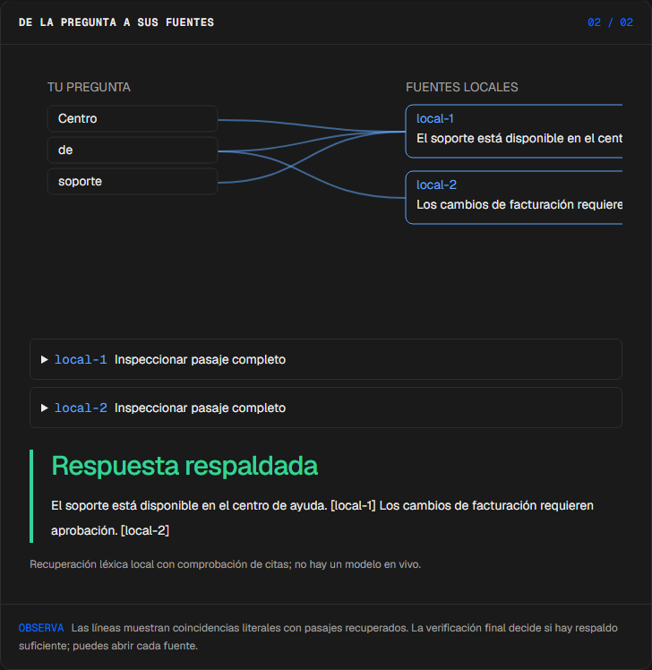
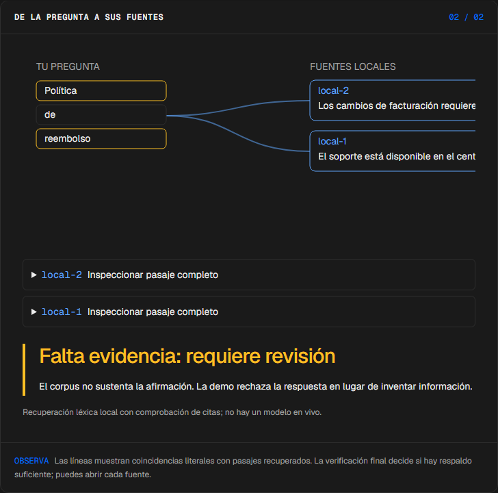
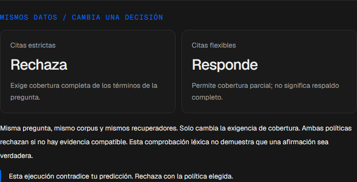
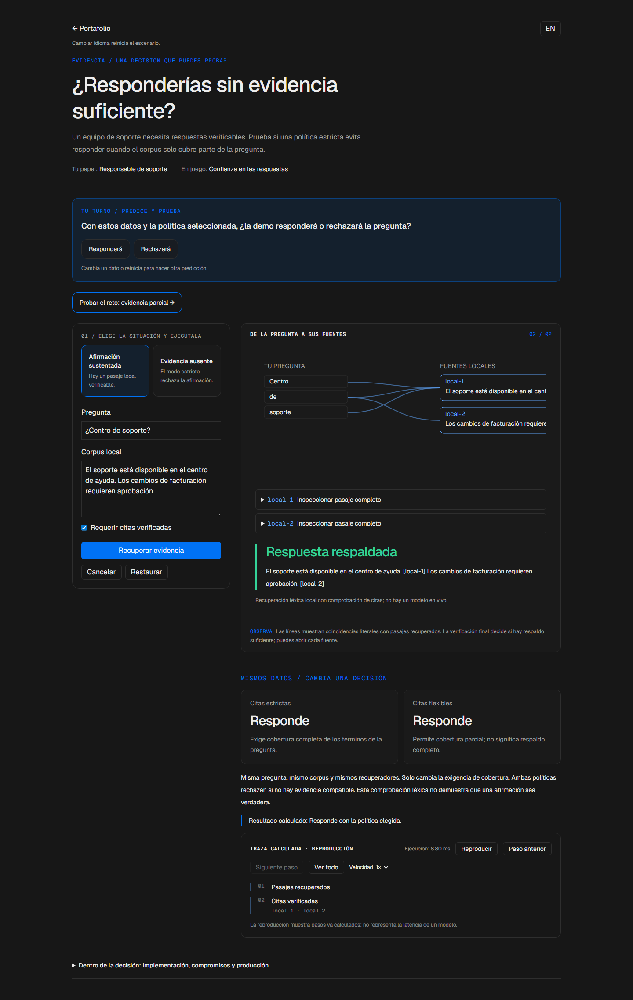

# Evidencia

<!-- community-badges -->
[](https://github.com/mdeasis27/evidencia/actions/workflows/ci.yml) [](LICENSE)
<!-- /community-badges -->

[English](README.md) · [Probar demo](https://evidencia-manueldeasis27-2515s-projects.vercel.app/es/app) · [Caso de estudio](https://portafolio-mdea.vercel.app/es/projects/evidencia) · [Código](https://github.com/mdeasis27/evidencia)


Edita un corpus local, pregunta e inspecciona pasajes recuperados y citas.

## Dos situaciones para comparar

**Afirmación sustentada:** Pregunta sobre soporte con pasaje local de soporte El pasaje local citado respalda la respuesta.



**Evidencia ausente:** Pregunta sobre reembolso sin pasaje de reembolso El flujo estricto rechaza la afirmación.



## Caso de uso de negocio

Una afirmación debe vincularse con pasajes locales recuperados.

**Quién lo usa:** Persona revisora de evidencia.

**La decisión:** Responder o rechazar.

Extraer términos, recuperar pasajes, verificar citas y responder o rechazar.

### Prueba la decisión

**Afirmación sustentada:** Pregunta sobre soporte con pasaje local de soporte El pasaje local citado respalda la respuesta.

**Evidencia ausente:** Pregunta sobre reembolso sin pasaje de reembolso El flujo estricto rechaza la afirmación.

Elige un escenario, modifica sus controles y ejecuta el cálculo local. Avanza por la visualización paso a paso o revela todo. Reinicia antes de comparar el segundo escenario.

## Cómo probarlo

Abre `/en/app` (inglés, por defecto) o `/es/app` (español). Cambia los datos del escenario y ejecuta el cálculo. Inspecciona la decisión, evidencia y traza calculada. La reproducción revela pasos locales ya completados; no mide un modelo en vivo. Reiniciar empieza un escenario local nuevo. Cambiar de idioma reinicia el escenario.

La demo principal no requiere cuenta, clave de API ni base de datos. Los enlaces públicos apuntan al despliegue existente; el rediseño local está pendiente de publicación.

<!-- recruiter-mission:start -->
### Tu misión interactiva

Elige evidencia parcial, predice si la política seleccionada responderá, ejecuta la recuperación y revela la traza completa.

La misma pregunta y el corpus se calculan con cobertura de citas estricta y flexible. Ambas pueden rechazar evidencia ausente. Es cobertura léxica, no una prueba de que la afirmación sea verdadera.

**Por qué este enfoque:** Combinar recuperadores léxicos permite inspeccionar pasajes y citas sin llaves API. Exigir cobertura completa prioriza cautela sobre la tasa de respuestas, pero no establece corrección semántica.

**Antes de producción:** Evaluar preguntas reales de soporte, calidad de citas, privacidad, permisos y respuestas sin evidencia antes de conectar un modelo.

Editar datos, elegir un escenario o reiniciar borra la predicción y los resultados anteriores. La comparación aparece al completar la reproducción; las demos principales no requieren cuenta ni llave.

El piloto de misiones actualiza esta implementación. Las capturas e informes de navegador existentes documentan la etapa anterior; las comprobaciones de interacción y capturas nuevas están pendientes por bloqueos del entorno actual.

<!-- recruiter-mission:end -->

## Instalación y verificación local

Requiere Node.js 22 y pnpm 10.

```sh
pnpm install --frozen-lockfile
pnpm dev
pnpm test
node node_modules/typescript/bin/tsc --noEmit --incremental false
pnpm lint
pnpm build
```

Abre `http://localhost:3000/en/app`. La validación registrada cubre pruebas, lint, TypeScript y builds de producción. Consulta los [resultados de comandos](docs/quality/decision-lab-verification.json) y las [comprobaciones de componentes en navegador](docs/quality/decision-lab-browser.json). Estas pruebas usan componentes React y CSS de producción con navegación de idioma controlada; no certifican rutas de Next ni el despliegue público.

## Arquitectura

- `app/[lang]/`: experiencia web por idioma.
- `lib/experience/`: adaptador local tipado, validación y trazas.
- `design-system/`: tokens visuales, controles de idioma y presentación de ejecución y reproducción.
- `app/api/`: integraciones opcionales de servidor; la demo principal no las requiere.

Tecnología: Next.js 16, TypeScript, Python, Vitest, pytest, Tailwind CSS v4.

## Evidencia y límites

La evidencia de la pregunta conecta pasajes recuperados e identificadores de cita.

Recuperación léxica y fundamentación heurística; rechaza preguntas sin respaldo.

Muestra identificadores de pasaje y soporte faltante.

**Límites:** Usa recuperación léxica sobre un corpus local. Estos prototipos de portafolio no afirman impacto medido en producción.

Los datos son ejemplos ficticios o anónimos. Las integraciones opcionales requieren sus propias credenciales y configuración. Los secretos pertenecen al gestor configurado, nunca a archivos locales de secretos ni Git. Usa el flujo existente `infisical run -- <command>` si necesitas integraciones en vivo. La demo local no publica ni despliega automáticamente.



<!-- community-section -->
## Licencia y contribución

Publicado bajo la [licencia MIT](LICENSE). Se aceptan issues y pull requests: lee antes [CONTRIBUTING.md](CONTRIBUTING.md) y el [Código de Conducta](CODE_OF_CONDUCT.md). Para reportar una vulnerabilidad, consulta [SECURITY.md](SECURITY.md).
<!-- /community-section -->
