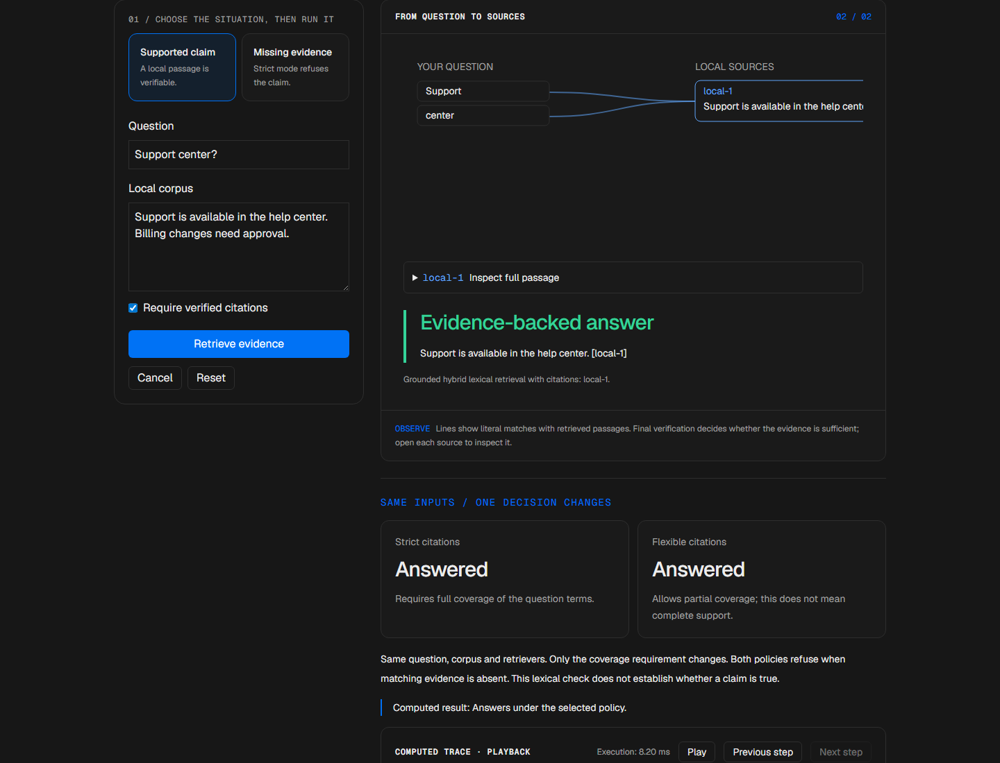
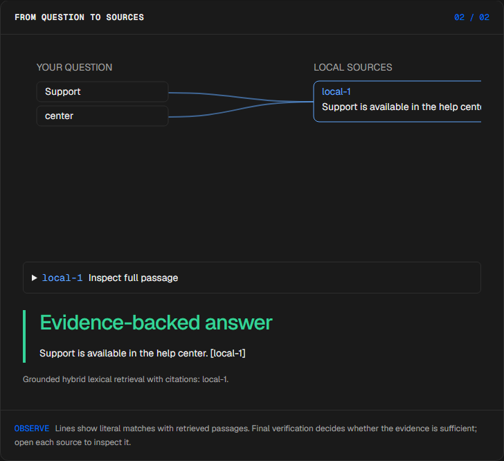
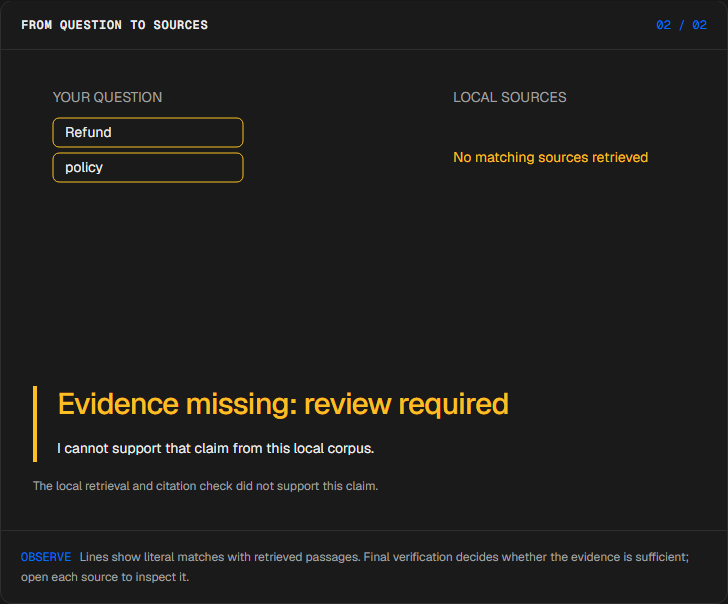
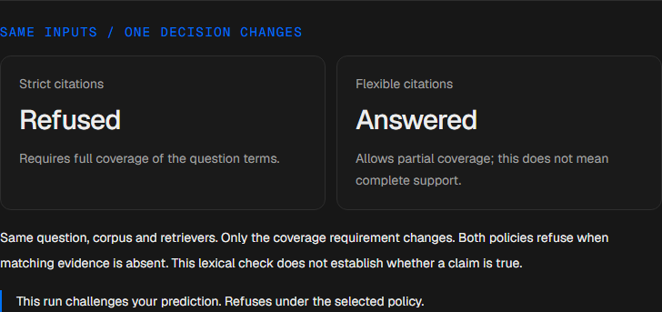
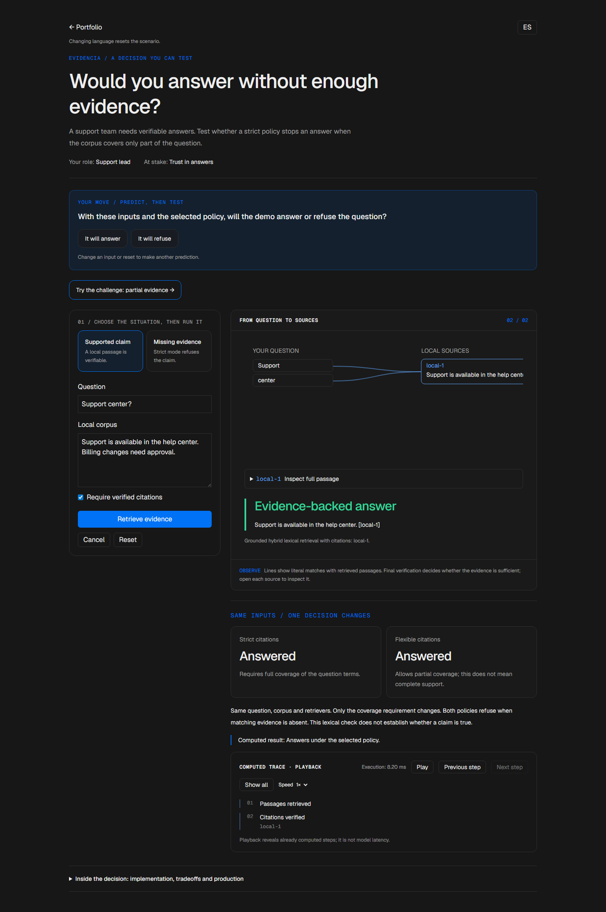

# Grounded answers

<!-- community-badges -->
[](https://github.com/mdeasis27/evidencia/actions/workflows/ci.yml) [](LICENSE)
<!-- /community-badges -->

[Español](README.es.md) · [Try the demo](https://evidencia-manueldeasis27-2515s-projects.vercel.app/en/app) · [Case study](https://manueldeasis.com/en/projects/evidencia) · [Source](https://github.com/mdeasis27/evidencia)



Edit a local corpus, ask a question and inspect retrieved passages and citations.

## Two situations to compare

**Supported claim:** Support center question with local support passage The cited local passage supports the answer.



**Missing evidence:** Refund question with no refund passage The strict workflow refuses the claim.



## Business use case

A claim must be tied to retrieved local passages.

**Who uses it:** Evidence reviewer.

**The decision:** Answer or refuse.

Extract terms, retrieve passages, verify citations, then answer or refuse.

### Try the decision

**Supported claim:** Support center question with local support passage The cited local passage supports the answer.

**Missing evidence:** Refund question with no refund passage The strict workflow refuses the claim.

Choose a scenario, edit its controls and run the local computation. Step through the visual process or reveal all steps. Reset before comparing the second scenario.

## How to try it

Open `/en/app` (English, default) or `/es/app` (Spanish). Change the scenario inputs and run the computation. Inspect the resulting decision, evidence and computed trace. Playback reveals completed local steps; it does not measure a live model. Reset starts a new local scenario. Changing language resets the scenario.

The primary demo needs no account, API key or database. Public links refer to the existing deployment; local redesign changes are pending publication.

<!-- recruiter-mission:start -->
### Your interactive mission

Choose partial evidence, predict whether the selected policy will answer, run retrieval and reveal the full trace.

The same question and corpus are computed under strict and flexible citation coverage. Missing evidence can be refused by both. This is lexical coverage, not proof that a claim is true.

**Why this approach:** Combined lexical retrievers make passages and citations inspectable without API keys. A strict coverage gate trades answer rate for caution, but cannot establish semantic correctness.

**Before production:** Evaluate real support questions, citation quality, privacy, access permissions and unsupported answers before connecting a model.

Editing inputs, choosing a preset or resetting clears the prediction and obsolete results. Comparisons appear only at completed playback; the primary demos need no account or key.

The mission pilot updates this implementation. Existing screenshots and browser reports document the previous stage; fresh browser interaction checks and captures are pending because the current environment blocked them.

<!-- recruiter-mission:end -->

## Local setup and verification

Requires Node.js 22 and pnpm 10.

```sh
pnpm install --frozen-lockfile
pnpm dev
pnpm test
node node_modules/typescript/bin/tsc --noEmit --incremental false
pnpm lint
pnpm build
```

Open `http://localhost:3000/en/app`. Recorded validation covers tests, lint, TypeScript and production builds. See [command results](docs/quality/decision-lab-verification.json) and [browser component checks](docs/quality/decision-lab-browser.json). The new browser checks exercise real React components and production CSS with controlled locale navigation; they do not certify Next routes or public deployment.

## Architecture

- `app/[lang]/`: localized browser experience.
- `lib/experience/`: typed local adapter, validation and run traces.
- `design-system/`: shared visual tokens, locale controls and execution/replay presentation.
- `app/api/`: optional server integrations; the primary demo does not require them.

Technology: Next.js 16, TypeScript, Python, Vitest, pytest, Tailwind CSS v4.

## Evidence and limitations

Question evidence connects to retrieved passages and citation identifiers.

Lexical retrieval and heuristic grounding; unsupported questions refuse.

Shows exact passage IDs and missing support.

**Limits:** Uses lexical retrieval over a local corpus. These portfolio prototypes do not claim measured production impact.

Inputs use fictional or anonymized examples. Optional live integrations require their own credentials and operational setup. Secrets belong in the configured secret manager, never in local secret files or Git. Use the existing `infisical run -- <command>` workflow when live integration is needed. This repository does not publish or deploy automatically as part of the local demo.



<!-- community-section -->
## License and contributing

Released under the [MIT License](LICENSE). Issues and pull requests are welcome: read [CONTRIBUTING.md](CONTRIBUTING.md) and the [Code of Conduct](CODE_OF_CONDUCT.md) first. To report a vulnerability, see [SECURITY.md](SECURITY.md).
<!-- /community-section -->
